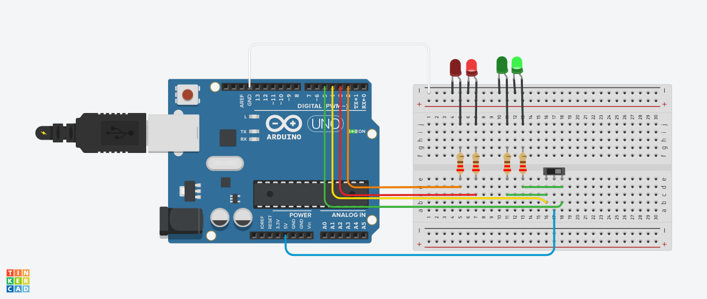

SIRALI LEDLER Bu uygulamada LED’lerin yanma sırasının anahtar vasıtasıyla değiştirilmesi amaçlanmaktadır.

Gerekli Devre Elemanları

• 1 adet mikrodenetleyici kart
• 1 adet breadboard
• 5 adet LED
• 5 adet 220Ω (kırmızı, kırmızı, kahverengi, altın rengi) direnç
• Bağlantı kabloları

